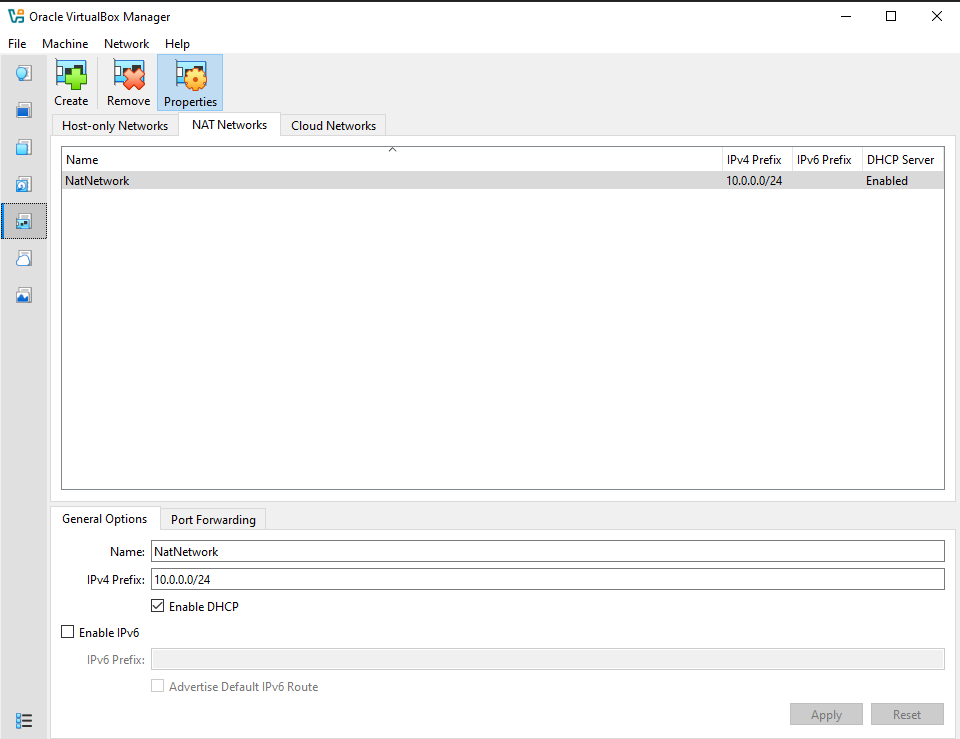
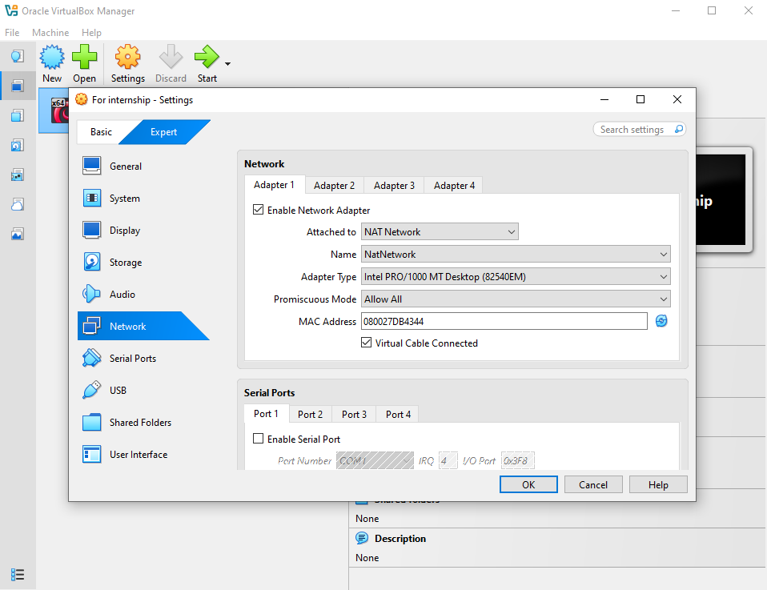
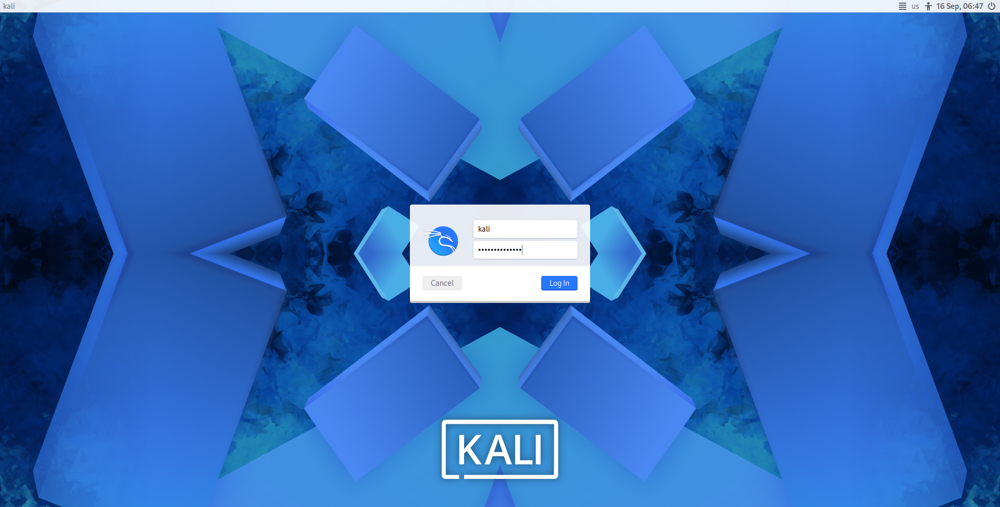
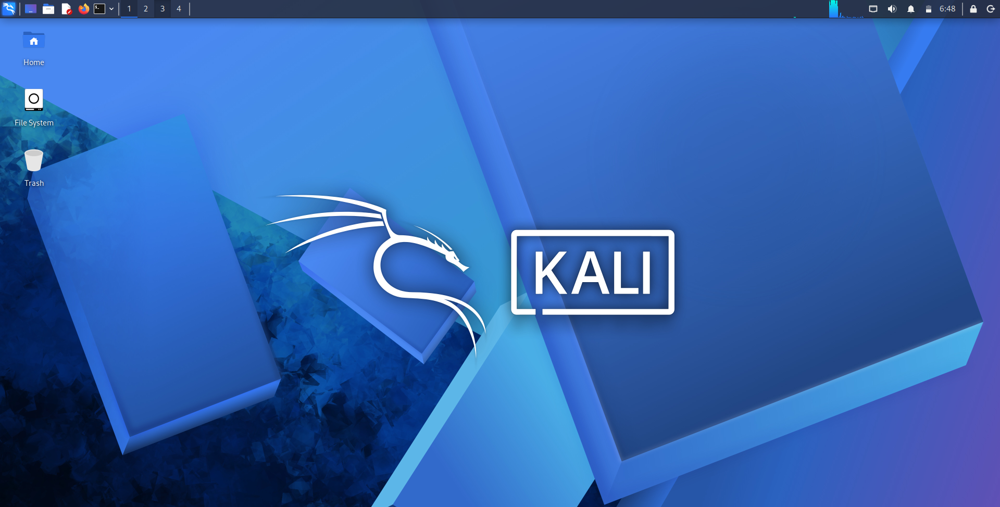
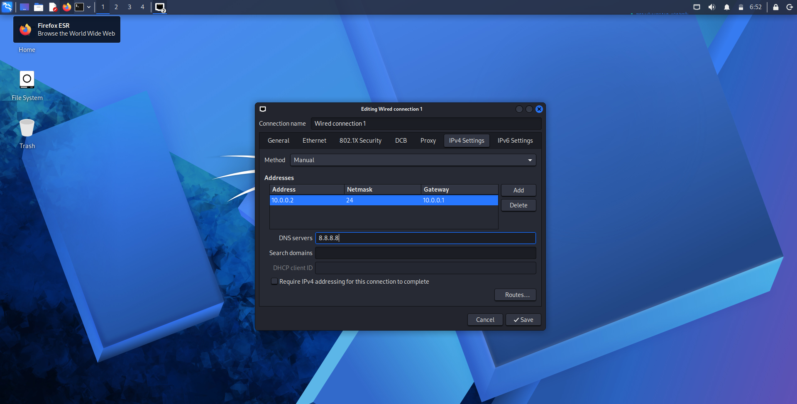
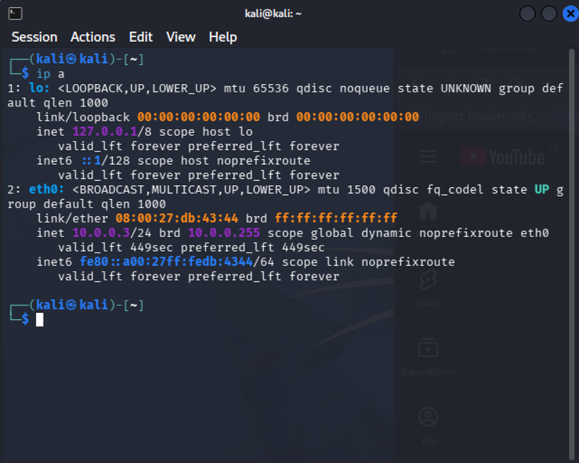
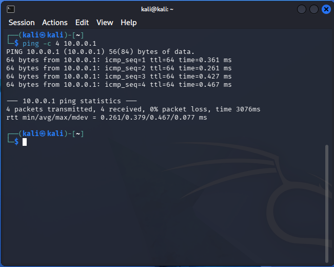
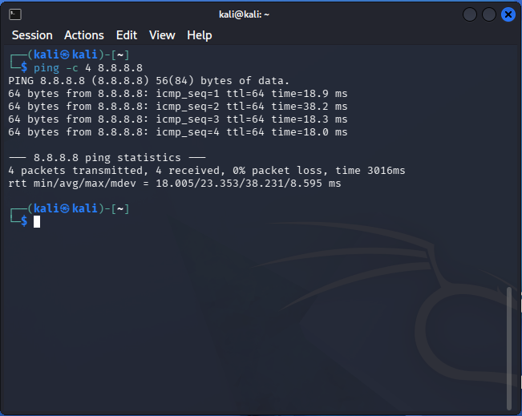
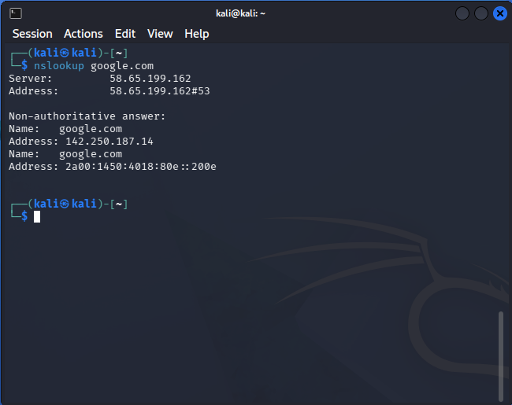
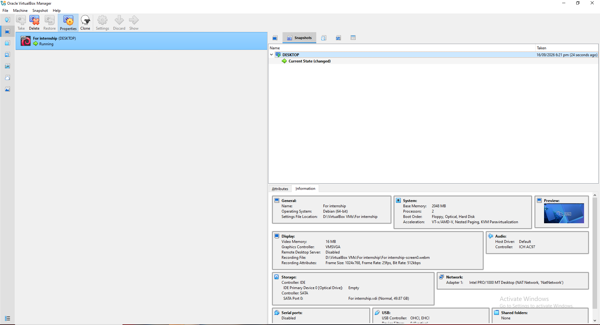

# 🔐 Cybersecurity Lab Environment Setup

**Building an isolated virtual lab for penetration testing and ethical hacking practice using VirtualBox and Kali Linux**


---

## 📌 Project Overview

This project documents the setup of a **virtual cybersecurity and penetration-testing lab** using VirtualBox and Kali Linux.

The goal is to build a controlled, isolated environment where network scanning, reconnaissance, vulnerability assessment, and other security-testing activities can be practiced safely and repeatedly — without touching any production or public network.

The lab runs on a private virtual network so additional target machines can be added later for hands-on, authorized testing exercises.

---

## 🎯 Objectives

- Install and configure VirtualBox as the hypervisor.
- Install/import Kali Linux as a virtual machine.
- Create a private **NAT Network** dedicated to the lab.
- Configure the Kali VM's network adapter and connectivity.
- Assign a consistent IP address to the Kali VM.
- Verify network connectivity and DNS resolution.
- Document the complete setup process, issues, and fixes.

---

## 🛡️ Purpose of the Lab

This lab provides an isolated environment for cybersecurity learning and authorized security testing, including:

- Network reconnaissance
- Port scanning
- Vulnerability assessment
- Packet analysis
- Web application security testing
- Exploitation practice
- General security-tool experimentation

> ⚠️ **Important:** This lab is for systems you own or have explicit permission to test. Never use it against unauthorized systems or networks.

---

## ⚙️ Lab Configuration

| Component          | Configuration              |
|--------------------|-----------------------------|
| 🖥️ Host OS          | Windows 11                  |
| 🧠 Host RAM         | 8 GB                         |
| ⚡ Processor        | Intel Core i5/i7             |
| 🧰 Hypervisor       | VirtualBox 7.2                |
| 🐉 Guest OS         | Kali Linux 2026.2              |
| 🧠 Kali RAM         | 2048 MB                        |
| 🌐 Virtual Network  | NAT Network                    |
| 📡 Network Address  | 10.0.0.0/24                     |
| 🐧 Kali IP Address  | 10.0.0.2/24                      |
| 🚪 Default Gateway  | 10.0.0.1                          |
| 🌍 DNS Server       | 8.8.8.8                             |
| 🔮 Future VM Range  | 10.0.0.3 – 10.0.0.99                 |


---

# Lab Setup Procedure

## Step 1. Install VirtualBox

Downloaded and installed VirtualBox from the official site to serve as the hypervisor for the lab.

**Tool:** VirtualBox 7.2

---

## Step 2. Create the NAT Network

Created a dedicated NAT Network inside VirtualBox so multiple VMs can talk to each other while still reaching the internet.

```
Network Name: NatNetwork
IPv4 Prefix:  10.0.0.0/24
DHCP:         Enabled
IPv6:         Disabled
```
**NAT Network Settings:**




A **NAT Network** (rather than plain NAT) was used because it lets multiple VMs on the same network communicate with one another — needed for future attacker/target VM setups — while still giving outbound internet access.

---

## Step 3. Import Kali Linux

Downloaded the official Kali Linux VirtualBox image and imported it as a new VM.

Network adapter configuration:

```
Adapter 1
Attached to:   NAT Network
Name:          NatNetwork
Adapter Type:  Intel PRO/1000 MT Desktop (82540EM)
Promiscuous Mode: Allow All
```

Allocated resources:

```
RAM: 2048 MB
```
**Network Adaptor Configuration:**



**Kali Linux Login:**



**Kali Linux Desktop:**



---

## Step 4. Configure the Kali Linux Network

Verified and set a consistent IP configuration inside the Kali VM.

```
IP Address:   10.0.0.2
Subnet Mask:  255.255.255.0
Gateway:      10.0.0.1
DNS:          8.8.8.8
```
**Checking Network Configuration**:



A fixed IP makes it easier to document the lab and reference the Kali machine in future exercises.

---

# 🔎 Lab Verification

| Test                     | Command                       | Expected Result             | Screenshot |
|---------------------------|-------------------------------|------------------------------|------------|
| Check IP address           | `ip a`                        | Correct Kali IP shown        | `6-Screenshot.png` |
| Test gateway               | `ping -c 4 10.0.0.1`            | Successful replies           | `Gateway_ping_test.png` |
| Test internet connectivity | `ping -c 4 8.8.8.8`              | Successful replies           | `Internet_Connectivity.png` |
| Test DNS resolution        | `nslookup google.com`             | Domain resolves               | `DNS_Resolution.png` |
| Verify Nmap install        | `nmap --version`                   | Nmap version displayed        | — |


**IP Address Verification:**



**Gateway Ping Test:**



**Internet Connectivity Test:**



**DNS Resolution Test:**



## Step 5. Create the Final Snapshot

After completing the configuration and verifying the connection, I created a final VirtualBox snapshot.

This provides a documented recovery point that can be used to return to the completed setup in the future.

### 📸 Evidence



# 🐞 Problems Encountered & Solutions

## Problem 1: Network adapter settings greyed out

While editing the Kali VM's network settings, some options (Adapter Type, MAC Address, Enable Network Adapter) appeared greyed out and couldn't be changed.

**Cause:** The VM was still running or in a saved state — VirtualBox locks these settings until the machine is fully powered off.

**Fix:**
1. Fully shut down the VM (ACPI shutdown from inside the guest, or Close → Power Off from VirtualBox Manager).
2. Reopen Settings → Network.
3. Adapter settings became editable.


# 💡 What I Learned

### 1. NAT vs NAT Network
A NAT Network lets multiple VMs on the same virtual network talk to each other while still sharing outbound internet access — essential for a multi-machine lab.

### 2. VM Network Adapter Locking
Several network adapter settings are locked while a VM is running or saved, and only become editable once the VM is fully powered off.

### 3. Static IP Configuration
Learned how to configure and verify IPv4 addressing, subnet masks, gateways, and DNS on Kali Linux.

### 4. Importance of Snapshots
Learned that a clean snapshot should ideally be taken right after the base setup, before any risky changes — this is a step I'm adding to my workflow going forward.

### 5. Documentation
Documenting each step, along with problems, solutions, and screenshots, is a core part of doing cybersecurity work professionally.

---

# 🔐 Security & Ethical Use

This lab is intended strictly for educational and authorized testing purposes only.

---

# 🔗 Tools & Resources

- **VirtualBox:** https://virtualbox.org/wiki/Downloads
- **Kali Linux:** https://kali.org/get-kali

---

# 👤 Author

**Bilal Ashfaq**

`Computer Science Student | Cybersecurity & Networking Enthusiast`

LinkedIn: https://www.linkedin.com/in/bilal-siddiqui-61562a333/
